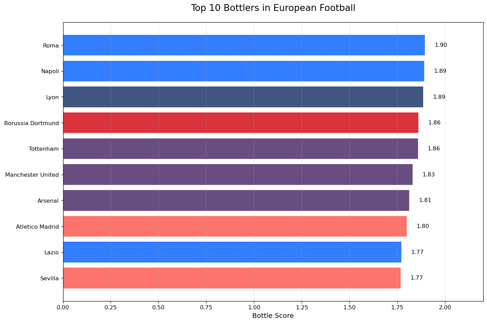
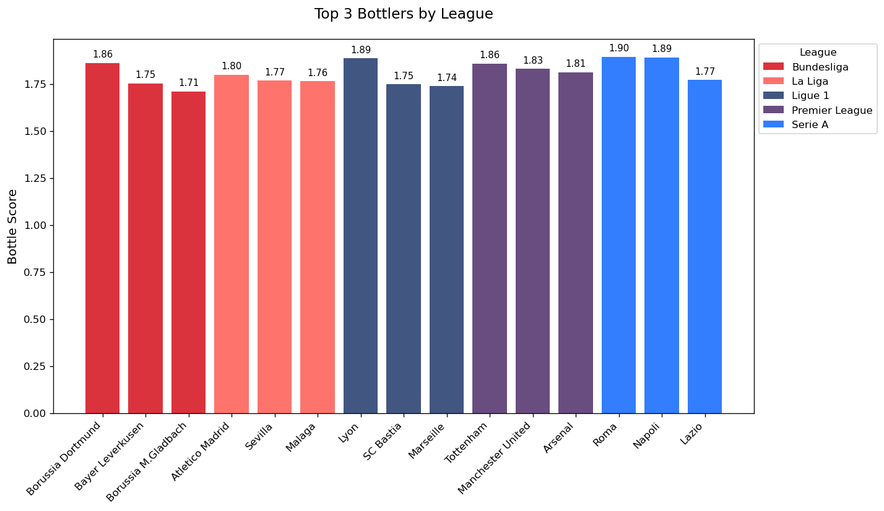

<div align="center">
    <h1>Bottlers FC</h1>
    <h3>[ 🍾⚽ ]</h3>
    <p><em>"An utterly unserious analysis of football pain"</em></p>
</div>

A data analysis project born out of sheer boredom and frustration with football teams that just can't seem to get over the line. _(Disclaimer: This is 90% banter, 10% questionable math)_

## What's This About?

After watching my favorite team [redacted] snatch defeat from the jaws of victory (again), I decided to quantify which teams are the biggest "bottlers" in European football. Using match data from the top 5 leagues, this script:

1. Calculates league positions for each team over multiple seasons
2. Creates a "bottle score" that punishes teams for:
   - Finishing close to the top without winning (2nd place is pain)
   - Being in smaller leagues (it's harder to bottle a 20-team league than a 10-team one)
   - Recent failures (fresh wounds hurt more)
3. Exposes the most consistent underachievers in European football

## Bottle Score Formula

The **Bottle Score (BS)** quantifies how spectacularly a team fails to meet expectations:

$$
\text{BS} = \begin{cases}
0 & \text{if league winners} \\
0.5^{\frac{i-2}{n-2}} \times w & \text{otherwise}
\end{cases}
$$

$$
i \rightarrow \text{League Position}\\
n \rightarrow \text{League Size}\\
w \rightarrow \text{Recency Weight}
$$

### Key Factors:

1. Position Penalty:

   - 2nd place hurts most (score = 1.0 before weighting)
   - Score decays exponentially for lower positions
   - Champions get 0 (they did their job)

2. League Size Normalization:

   - Bottling in a 20-team league (EPL) is harder than in a 10-team league

3. Recency Weight:

   - Recent failures (2020) count 3×
   - Older seasons (2014) count 1×
   - Linear scaling in between

**Example**:

A 2nd place finish in 2020 (20-team league):

```
(0.5)^(0) × 3 = 3.0 BS
```

_(Peak bottling performance!)_

**Disclaimer**:
This is _clearly_ an unscientific, tongue-in-cheek metric created for banter purposes.

## The Results Are In!

<div style="display: flex; flex-wrap: wrap; justify-content: center; gap: 2px; margin-top: 1rem;" align="center">
    
    
</div>
<br>

The biggest bottlers according to my _\*highly scientific\*_ metric:

- **Premier League**: Tottenham (because of course)
- **La Liga**: Atletico Madrid
- **Bundesliga**: Borussia Dortmund
- **Serie A**: Roma (with Napoli close behind)
- **Ligue 1**: Lyon

_Full disclosure: My team (Arsenal) appears suspiciously high in these rankings, which I can only assume is a data error._

## Data Source

This analysis uses the [European Football Database](https://www.kaggle.com/datasets/technika148/football-database) from Kaggle, which contains match data from 2014-2020.

## How to Use

1. Clone this repo
2. Install requirements: `pandas`, `numpy`, `matplotlib`
3. Download the dataset from [Kaggle](https://www.kaggle.com/datasets/technika148/football-database) and place in `/data`
4. Run `main.ipynb` to:
   - See which teams break their fans' hearts the most
   - Generate beautiful (and painful) visualizations
   - Discover if your team made the Hall of Shame

## License

This masterpiece of football analytics is released under [MIT License](./LICENSE) - meaning you're free to use it to roast your rival's team, just don't blame me when the stats hurt your feelings.

## Data Source

This analysis uses the [European Football Database](https://www.kaggle.com/datasets/technika148/football-database) from Kaggle.

- **Last Updated**: August 2021
- **License**: [CC0 Public Domain](https://creativecommons.org/publicdomain/zero/1.0/)

> _Created by a heartbroken Gooner during "trusting the process"._
