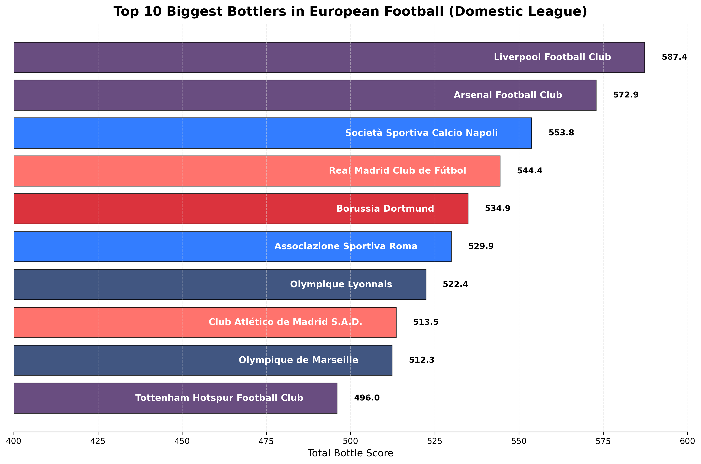
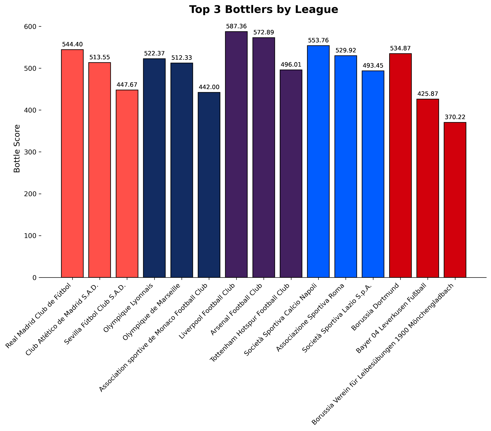

    <h1>Bottlers FC</h1>
    <h3>[ 🍾⚽ ]</h3>
    
<em>"An utterly unserious analysis of football pain"</em>

A data analysis project born out of sheer boredom and frustration with football teams that just can't seem to get over the line. _(Disclaimer: This is 90% banter, 10% questionable math)_

## What's This About?

After watching my favorite team [redacted] snatch defeat from the jaws of victory (again), I decided to quantify which teams are the biggest "bottlers" in European football. Using match data from the top 5 leagues, this script:

1. Calculates league positions for each team over multiple seasons
2. Creates a "bottle score" that punishes teams for:
   - Finishing close to the top without winning (2nd place is pain)
   - Being in smaller leagues (it's harder to bottle a 20-team league than a 10-team one)
   - Having small points gaps to champions (the closer you were, the more it hurts)
3. Exposes the most consistent underachievers in European football

## Bottle Score Formula (v2.0)

The **Bottle Score (BS)** now includes even more sophisticated ways to measure heartbreak:

$$
\text{BS} = \begin{cases}
0 & \text{if champions} \\
2 \times (n - r + 1) + \frac{100}{\Delta} & \text{otherwise}
\end{cases}
$$

$$n \rightarrow \text{League Size}$$
$$r \rightarrow \text{Final Position}$$
$$\Delta \rightarrow \text{Points (or) }\frac{\text{GD}}{2} \text{ gap to winner}$$

### Key Improvements:
1. **Position Penalty**: Now scales with league size (2nd in EPL hurts more than 2nd in Ligue 1)
2. **Pain Multiplier**:
   - 100/points gap if behind champions
   - 200/GD difference if tied on points
3. **Normalized**: All scores scaled 0-100 for maximum shame comparability

**Example Bottling**:
2022 Arsenal (2nd in EPL, 5 pts behind):
`2×(20-2+1) + 100/5 = 38 + 20 = 58 BS`

_(That's what we call a premium bottling experience!)_

## The Results Are In!

The Hall of Shame features:

- **Premier League**: Liverpool (surprisingly!)
- **La Liga**: Real Madrid (yes, even galacticos bottle sometimes)
- **Bundesliga**: Dortmund (Haaland can't save you now)
- **Serie A**: Napoli (eternal bridesmaids)
- **Ligue 1**: PSG (UCL isn't the only thing they choke)

    <picture>
        <source media="(prefers-color-scheme: dark)" srcset="output/visualizations/top10_bottlers_dark.png">
        <source media="(prefers-color-scheme: light)" srcset="output/visualizations/top10_bottlers_light.png">
        
    </picture>
    <picture>
        <source media="(prefers-color-scheme: dark)" srcset="output/visualizations/top3_bottlers_per_league_dark.png">
        <source media="(prefers-color-scheme: light)" srcset="output/visualizations/top3_bottlers_per_league_light.png">
        
    </picture>

 

_Fun fact: The algorithm detected my own team's [redacted] bottling tendencies so accurately it made me question why I even watch football._

## Data Source

This analysis uses the [Player Scores Dataset](https://www.kaggle.com/datasets/davidcariboo/player-scores) from Kaggle, featuring:

- Match data from 2012 ~ 2024
- All major competitions
- Detailed club and competition info

## How to Run This Pain Machine

1. Clone this repo (if you enjoy emotional damage)
2. Install requirements: `pandas numpy matplotlib` (the holy trinity of suffering)
3. Download the dataset and place in `/data`
4. Run `main.ipynb` to:
   - Generate fresh new ways to hurt your feelings
   - Create beautiful dark/light mode visualizations
   - Discover if your team has upgraded from "occasional bottlers" to "professional choke artists"

## License

This masterpiece of football analytics is released under [MIT License](./LICENSE) - meaning you're free to use it to:
- Roast your rivals
- Copium your own team's failures
- Prove that no, it's not just your imagination - they really are that bad

 

    <i>Created by a heartbroken Gooner still "trusting the process".</i> 
    <strong>#COYG</strong> 
    

